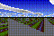

# Asahi Renderer
Integer-only 3D graphics anywhere

## Dependencies
- Some C compiler
- libc

## Building
Run the ```make.sh``` file with a POSIX-compliant shell:
```sh
sh make.sh
```

## Execution
Upon execution an image in the PPM file format will be written to stdout. You can pipe the output to an image viewer like feh with the following command:
```sh
./render | feh -
```

Or to FFmpeg:
```sh
./render | ffmpeg -i - -sws_dither bayer output.gif
```

